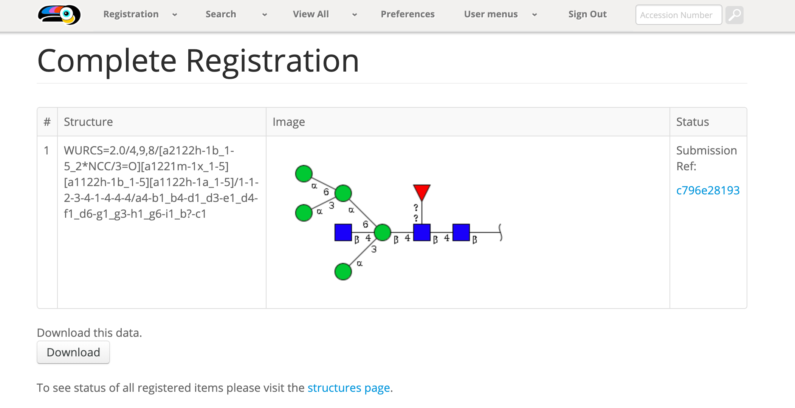
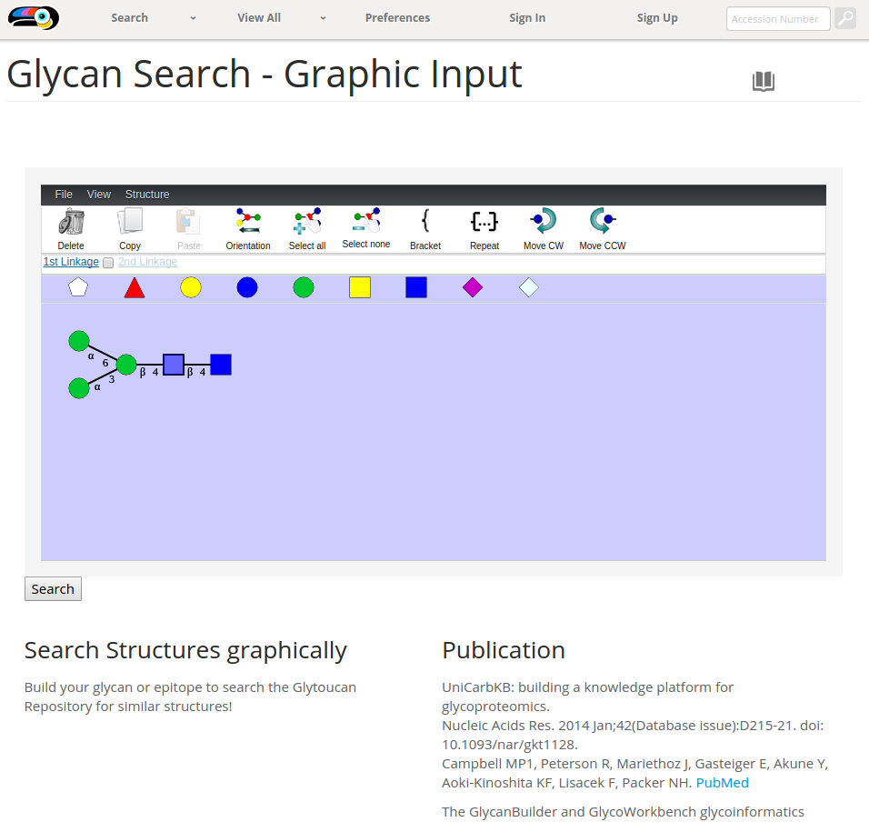
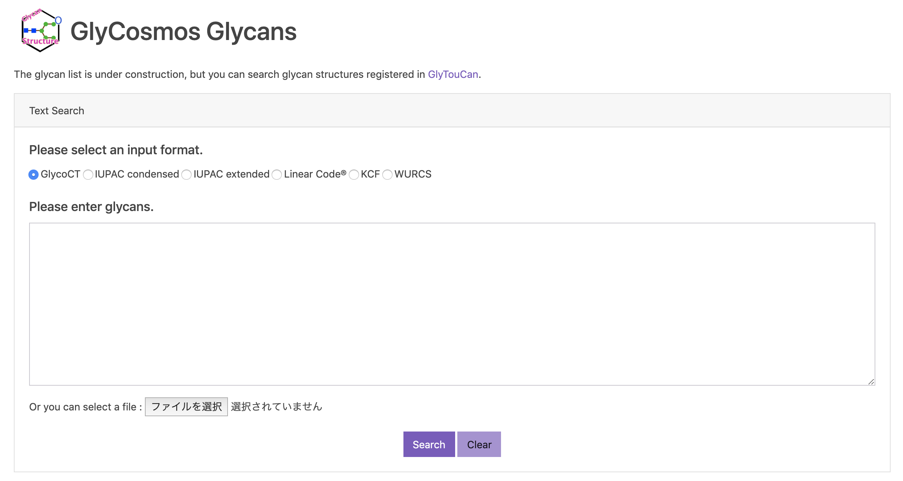

This page will be updated with documentation on new functionality as it is added.  If there is something missing, please [let us know](/team)!

Registration
-----------------------------------------

Registration is the main functionality of glytoucan.  Below are the currently available methods of adding glycan sequences, as well as what happens behind the scenes when they are registered.  Other methods of registration are currently being investigated, [your input](mailto: support@glytoucan.org) would be a great help!

<ul class="lesson-images">
  <li>
    <a href="../manual/registration-graphical">
      
      <h3>Graphic Input</h3>
    </a>
  </li>
  <li>
    <a href="../manual/registration-text">
      
      <h3>Text Input</h3>
    </a>
  </li>
  <li>
    <a href="../manual/registration-upload">
      
      <h3>File Upload</h3>
    </a>
  </li>
  <li>
    <a href="../manual/registration-result">
      
      <h3>Registration Results</h3>
    </a>
  </li>
</ul>

Search
---------------

The search functionality displays the wealth of information that was gathered from the currently available data in public Glycan databases.  This functionality will be constantly improved and expanded to include data requested by users.

<ul class="lesson-images">
  <li>
    <a href="../manual/search-graphical">
      
      <h3>Graphic Input</h3>
    </a>
  </li>
  <li>
    <a href="../manual/search-text">
      
      <h3>Text Input</h3>
    </a>
  </li>
  <li>
    <a href="../manual/search-motif">
      
      <h3>By Motif</h3>
    </a>
  </li>
  <li>
    <a href="../manual/search-substructure">
      
      <h3>Substructures</h3>
    </a>
  </li>
  <li>
    <a href="../manual/search-id">
      
      <h3>By ID</h3>
    </a>
  </li>
</ul>

Browse
---------------

The browse all functionality provides a quick way to view all of a specific data type.  All data in the glycan repository can be viewed from these interfaces. 

<ul class="lesson-images">
  <li>
    <a href="../manual/browse-motif">
      
      <h3>View all Motifs</h3>
    </a>
  </li>
  <li>
    <a href="../manual/browse-glycan">
      
      <h3>View all Glycans</h3>
    </a>
  </li>
</ul>
