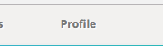
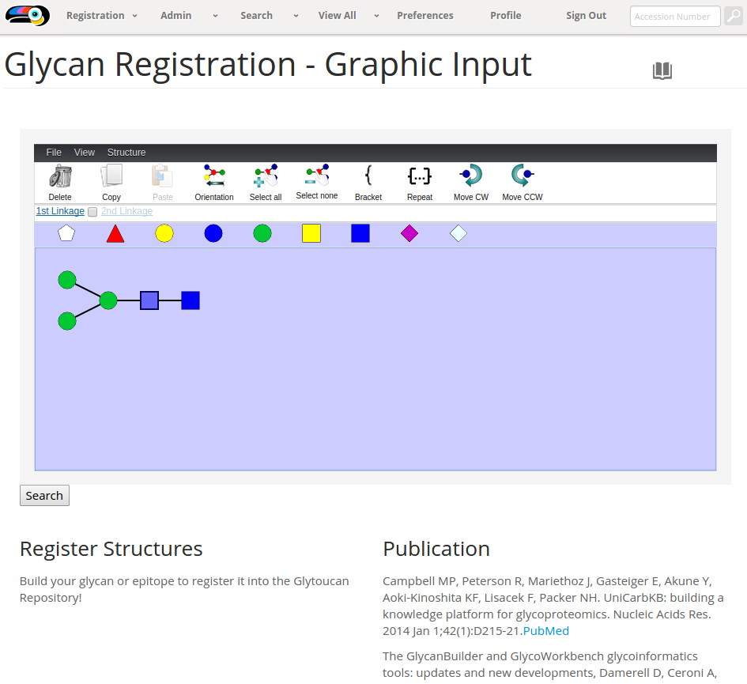
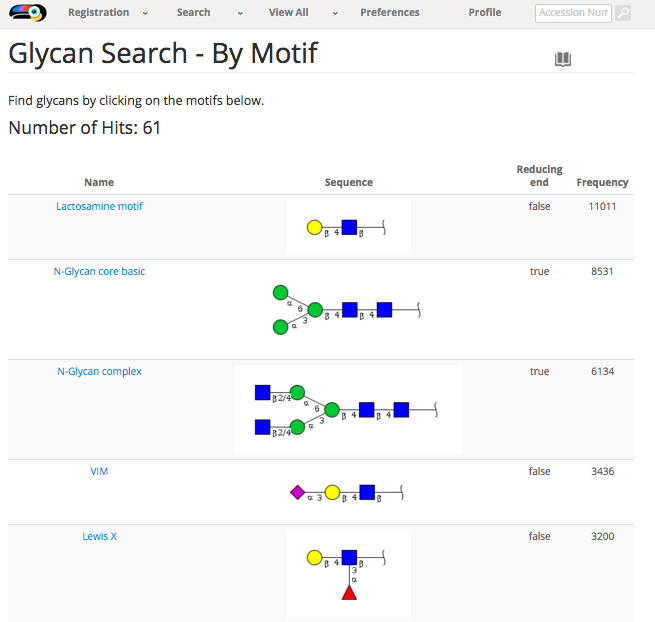
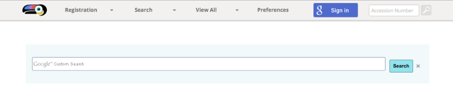

This page will be updated with documentation on new functionality as it is added.  If there is something missing, please [let us know](/team)!

User Preferences
-----------------------------------------
The user preferences page is usable by all users of the repository.  This can be used to configure the display settings for all aspects of GlyTouCan.

 

<ul class="lesson-images">
  <li>
    <a href="../manual/preferences">
      
      <h3 style="text-align: center;">Preferences</h3>
    </a>
  </li>
  <li>
    <a href="../manual/profile">
      
      <h3 style="text-align: center;">Profile</h3>
    </a>
  </li>
</ul>

Registration
-----------------------------------------

In order to register structures into GlyTouCan, it is necessary to sign up to the site using Google Authentication.  GlyTouCan will request from google your email address, and your first and last name.  Only the first name will be displayed when a new structure is registered.

Registration is the main functionality of GlyTouCan.  Below are the currently available methods of adding glycan sequences, as well as what happens behind the scenes when they are registered.  Other methods of registration are currently being investigated, [your input](mailto: support@glytoucan.org) would be of great help!

 

<ul class="lesson-images">
  <li>
    <a href="../manual/registration-graphical">
      
      <h3 style="text-align: center;">Graphic Input</h3>
    </a>
  </li>
  <li>
    <a href="../manual/registration-text">
      
      <h3 style="text-align: center;">Text Input</h3>
    </a>
  </li>
  <li>
    <a href="../manual/registration-upload">
      
      <h3 style="text-align: center;">File Upload</h3>
    </a>
  </li>
  <li>
    <a href="../manual/registration-result">
      
      <h3 style="text-align: center;">Registration Results</h3>
    </a>
  </li>
  <li>
    <a href="../manual/publication-registration">
      
      <h3 style="text-align: center;">Publication Registration</h3>
    </a>
  </li>
</ul>

Search
---------------

The search functionality displays the wealth of information that was gathered from the currently available data in the public Glycan databases.  This functionality will constantly be improved and expanded to include data requested by the users.

 

<ul class="lesson-images">
  <li>
    <a href="../manual/search-graphical">
      
      <h3 style="text-align: center;">Graphic Input</h3>
    </a>
  </li>
  <li>
    <a href="../manual/search-text">
      
      <h3 style="text-align: center;">Text Input</h3>
    </a>
  </li>
  <li>
    <a href="../manual/search-motif">
      
      <h3 style="text-align: center;">By Motif</h3>
    </a>
  </li>
  <li>
    <a href="../manual/search-id">
      
      <h3 style="text-align: center;">By ID</h3>
    </a>
  </li>
  <li>
    <a href="../manual/search-engine">
      
      <h3 style="text-align: center;">Search Engine</h3>
    </a>
  </li>
</ul>

View
---------------

The View All functionality provides a quick way to browse all of the specific data type.  All data in the glycan repository can be analyzed from these interfaces.

 

<ul class="lesson-images">
  <li>
    <a href="../manual/browse-motif">
      
      <h3 style="text-align: center;">View all Motifs</h3>
    </a>
  </li>
  <li>
    <a href="../manual/browse-glycan">
      
      <h3 style="text-align: center;">View all Glycans</h3>
    </a>
  </li>
</ul>
